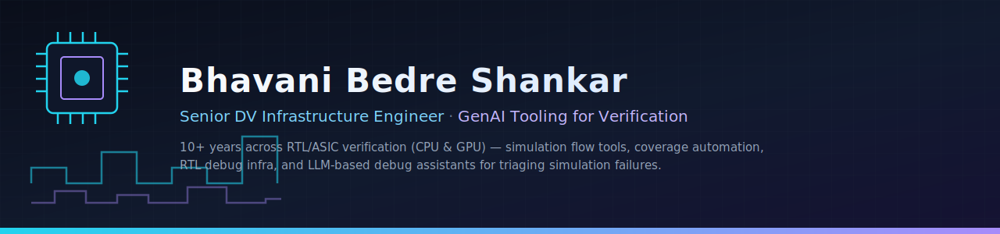

  

 

10+ years building and verifying hardware at the RTL/ASIC level — SoC and IP-level verification for CPU and GPU, from writing verification plans and directed/random tests to building C++ golden reference models used as sign-off references for RTL. For the last few years I've owned the **DV infrastructure** side: simulation flow tooling, coverage automation, VCS testing/migration, and the RTL debug tooling verification teams rely on daily.

More recently, I've been building **LLM-based tooling for DV workflows** — chat-based debug assistants that triage simulation failures (pre-compile, compile, sim, generic fails) and suggest fixes, and failure-triage reporting for regression runs.

- 🔭 Currently focused on DV methodology & infrastructure, and GenAI-assisted debug tooling
- 🧠 Interested in where LLM agents meet hardware verification — RTL-aware debuggers, automated triage, agentic sim-flow tools
- 🎓 M.S. Computer Engineering, Texas A&M University
- 🏆 1st place, Hack@DAC (DAC 2018)

 

### Core Stack

  
  
  
  
  

  
  
  
  

 

<!-- PROJECTS:START -->
### Projects

<table>
  <tr>
    <th>Project</th>
    <th>Description</th>
    <th>Tech Stack</th>
  </tr>
  <tr>
    <td valign="top"><a href="https://github.com/bhavanibedreshankar/tpe-tensor-processing-engine"><b>🔧 tpe-tensor-processing-engine</b></a></td>
    <td valign="top">Built as the base framework I'll develop several AI automations on top of — a from-scratch AI accelerator with RTL, a C++ golden model, and a full <code>pyuvm</code>/<code>cocotb</code> verification environment, including 7 intentionally-catalogued bugs to exercise the flow.</td>
    <td valign="top"><i>RTL · C++ · UVM · Verification Methodology</i></td>
  </tr>
  <tr>
    <td valign="top"><a href="https://github.com/bhavanibedreshankar/agentic_ai_basics"><b>🤖 agentic_ai_basics</b></a></td>
    <td valign="top">My cheatsheet for agentic AI concepts — a learning series of small, self-contained Python templates for building with the Claude API.</td>
    <td valign="top"><i>Python · Claude API · Agentic Patterns</i></td>
  </tr>
  <tr>
    <td valign="top"><a href="https://github.com/bhavanibedreshankar/road-rage"><b>🎮 road-rage</b></a></td>
    <td valign="top">Built to put the Fable5 model's capabilities to the test — a browser-based synthwave motorcycle combat racer in Canvas 2D / vanilla JS, single HTML file.</td>
    <td valign="top"><i>HTML5 · Canvas · JavaScript</i></td>
  </tr>
  <tr>
    <td valign="top"><a href="https://github.com/bhavanibedreshankar/familyfinance"><b>💰 familyfinance</b></a></td>
    <td valign="top">A personal app for managing family finances and planning for retirement — self-hosted dashboard with Plaid account aggregation, expense tracking, net worth/property tracking, reports, and a Monte Carlo retirement planner.</td>
    <td valign="top"><i>Python · Plaid API · Monte Carlo Simulation</i></td>
  </tr>
  <tr>
    <td valign="top"><a href="https://github.com/bhavanibedreshankar/expense-tracker-ai"><b>💸 expense-tracker-ai</b></a></td>
    <td valign="top">My first project, built just for fun with Claude Code — a private, local-first personal expense tracker.</td>
    <td valign="top"><i>Next.js · TypeScript · Tailwind CSS</i></td>
  </tr>
</table>
<!-- PROJECTS:END -->

 

### Let's Connect

  

